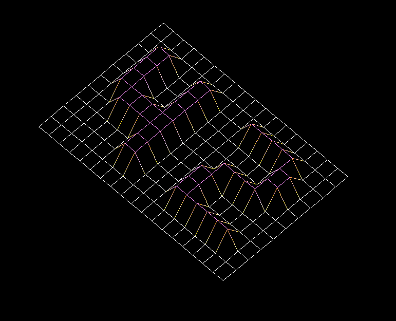

# FDF
[Видеогайд](https://www.youtube.com/watch?v=10P59aOgi68&t=1312s) \
[VBrazhnik](https://github.com/VBrazhnik/FdF/wiki)
---
## Вступление
Изображение ландшафта в 3D - важнейший аспект современного картографирования.
Например, в наше время пространственных исследований получение трехмерного изображения Марса является
предварительным условием его покорения. В качестве другого примера, сравнение различных трехмерных
изображений области высокой тектонической активности позволит вам лучше понять эти явления и их
развитие и, как результат, лучше подготовиться. \
Сегодня ваша очередь моделировать в 3D великолепные пейзажи, вымышленные или нет ...
## Цели
В этом проекте вы откроете для себя основы графического программирования, в частности, как размещать
точки в пространстве, как соединять их с сегментами и, что наиболее важно, как наблюдать за сценой
с определенной точки зрения.
Вы также откроете для себя свою первую графическую библиотеку:`miniLibX`. Эта библиотека была
разработана внутри компании и включает минимум, необходимый для открытия окна, освещения пикселя
и обработки событий, связанных с этим окном: клавиатуры и мыши. Этот проект знакомит вас с
программированием «событий».
## Общие инструкций
* Ваш проект должен быть написан в соответствии с Нормой. Если у вас есть бонусные файлы / функции,
  они включаются в проверку нормы, и вы получите 0, если внутри есть ошибка нормы.
* Ваши функции не должны завершаться неожиданно (ошибка сегментации, ошибка шины, двойное
  освобождение и т.д.), за исключением неопределенного поведения. Если это произойдет, ваш проект
  будет считаться нефункциональным и получит 0 во время оценки.
* Все пространство памяти, выделенное кучей, должно быть должным образом освобождено при необходимости.
  Утечки недопустимы.
* Если субъект требует этого, вы должны отправить Makefile, который скомпилирует ваши исходные файлы
  в требуемый вывод с флагами -Wall, -Wextra и -Werror, и ваш Makefile не должен повторно связываться.
* Ваш Makefile должен содержать как минимум правила `$(NAME)`, `all`, `clean`, `fclean` и `re`.
* Чтобы превратить бонусы в свой проект, вы должны включить правило `bonus` в свой Makefile, который
  добавит все различные заголовки, библиотеки или функции, запрещенные в основной части проекта.
  Бонусы должны быть в другом файле `_bonus.{c/h}`.  Оценка обязательной и бонусной части проводится отдельно.
* Если ваш проект позволяет вам использовать ваш libft, вы должны скопировать его исходный
  код и связанный с ним Makefile в папку libft с соответствующим Makefile. Makefile вашего проекта
  должен скомпилировать библиотеку, используя свой Makefile, а затем скомпилировать проект.
* Мы рекомендуем вам создавать программы тестирования для вашего проекта, даже если эту работу не
  нужно будет отправлять и оценивать. Это даст вам возможность легко проверить свою работу и работу
  коллег. Вы найдете эти тесты особенно полезными во время защиты. Действительно, во время защиты
  вы можете использовать свои тесты и / или тесты партнера, которого вы оцениваете.
* Отправьте свою работу в назначенный репозиторий git. Оцениваться будет только работа
  в репозитории git. Если DeepThreadt назначен для оценки вашей работы, это будет сделано после ваших
  оценок коллег. Если во время выставления оценок Deep Threatt в каком-либо разделе вашей работы
  произойдет ошибка, оценка будет остановлена.
* Этот проект будет исправляться только людьми. Итак, не стесняйтесь организовывать и называть
  файлы по своему усмотрению, но в пределах перечисленных здесь ограничений.
    * Исполняемый файл должен называться `fdf`.
    * Вы должны отправить Makefile.
    * Вы не можете использовать глобальные переменные.
    * Вы должны использовать `miniLibX`. Либо в той версии, которая доступна
      в системе, либо из ее исходников. Если вы решите работать с источниками,
      вам нужно будет применить те же правила для вашего libft, что и написанные выше.
* Для обязательной части вам разрешено использовать следующие функции:
    * `open`, `read`, `write`, `close`
    * `malloc`, `free`
    * `perror`, `strerror`
    * `exit`
    * Все функции, определенные в библиотеке `math` (`-lm` и `man 3 math`)
    * Все функции, определенные в библиотеке `miniLibX`.
    * Вам разрешается использовать другие функции для завершения бонусной части, если их использование
      оправдано во время вашей оценки. Будь умным!
    * Вы можете задать свои вопросы на форуме, в Slack и т.д.
  
## Основная часть
Это проект по созданию упрощенного графического «каркаса» («fils de fer» на французском языке,
отсюда и название проекта) представления рельефного ландшафта, соединяющего различные точки (x, y, z) с
помощью сегментов. Координаты этого ландшафта хранятся в файле, передаваемом вашей программе в 
качестве параметра. Вот пример:
```shell
$>cat 42.fdf
0 0 0 0 0 0 0 0 0 0 0 0 0 0 0 0 0 0 0
0 0 0 0 0 0 0 0 0 0 0 0 0 0 0 0 0 0 0
0 0 10 10 0 0 10 10 0 0 0 10 10 10 10 10 0 0 0
0 0 10 10 0 0 10 10 0 0 0 0 0 0 0 10 10 0 0
0 0 10 10 0 0 10 10 0 0 0 0 0 0 0 10 10 0 0
0 0 10 10 10 10 10 10 0 0 0 0 10 10 10 10 0 0 0
0 0 0 10 10 10 10 10 0 0 0 10 10 0 0 0 0 0 0
0 0 0 0 0 0 10 10 0 0 0 10 10 0 0 0 0 0 0
0 0 0 0 0 0 10 10 0 0 0 10 10 10 10 10 10 0 0
0 0 0 0 0 0 0 0 0 0 0 0 0 0 0 0 0 0 0
0 0 0 0 0 0 0 0 0 0 0 0 0 0 0 0 0 0 0
$>
```
Каждому числу соответствует точка в пространстве:
* Горизонтальное положение соответствует его абсциссе.
* Вертикальное положение соответствует его ординате.
* Значение соответствует его высоте.
Если вы запустите свою программу `fdf` для этого файла, мы должны увидеть что-то вроде этого:
```shell
$>./fdf 42.fdf
$>
```


Не забудьте оптимально использовать ваш `libft`! Использование `get_next_line`, `ft_split` и `ft_getnbr` позволит вам
быстро и просто читать данные из файла.

Помните, что цель этого проекта - не разбирать карты! Это не означает, что ваша программа может дать
сбой при запуске... это означает, что карта, содержащаяся в файле, будет правильно отформатирована.

Что касается графического изображения:
* Ваш fdf-файл должен отображать карту в изометрической проекции.
* Вы должны иметь возможность выйти из программы, нажав 'esc'.
* Использование `images` из `minilibX`не требуется для валидации проекта, даже мы настоятельно рекомендуем вам их использовать.
* Найдите прикрепленный двоичный файл с именем `fdf`, а также пример `42.fdf` внутри fdf.zip)

## Бонусная часть
Обычно мы советуем вам добавлять свои собственные оригинальные бонусы, но есть и другие графические проекты, которые ждут вас
гораздо интереснее!! Не сходите с ума, двигайтесь вперед быстро! \
Вы получите дополнительные баллы, если сможете:
* Включите дополнительную проекцию (например, параллельную или коническую)!
* Было бы здорово иметь возможность увеличивать масштаб и переводить карту, не так ли?
* А как насчет поворота карты?